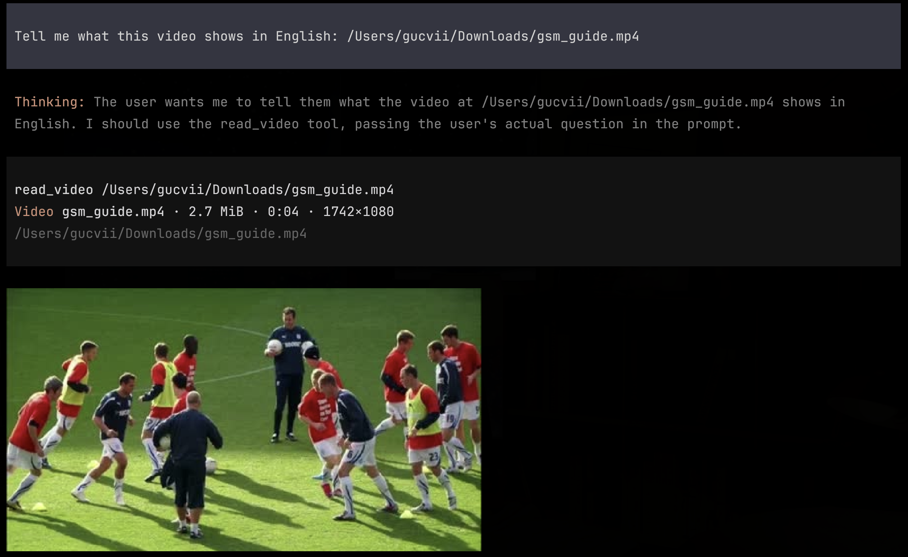
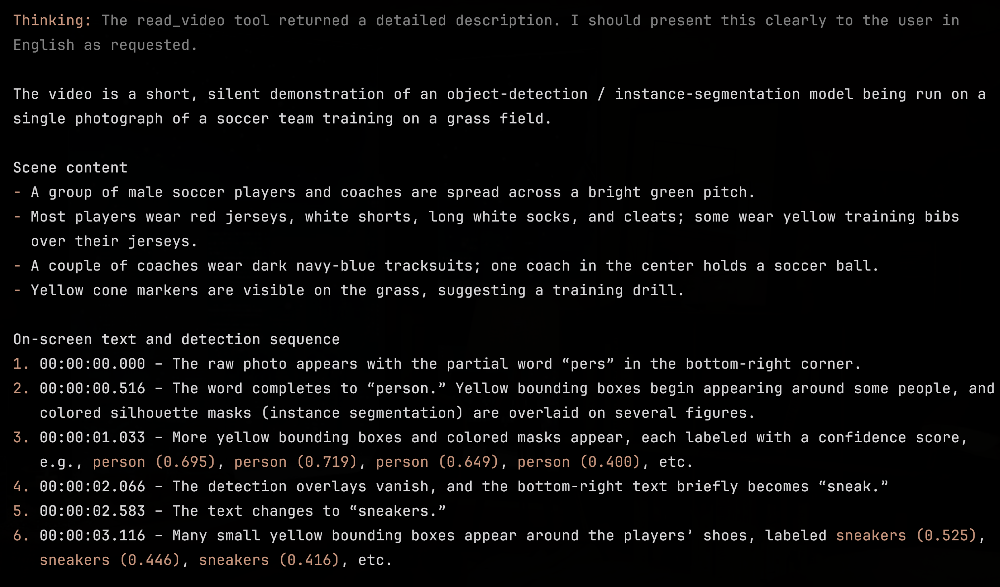

# pi-kimi-video

[](https://github.com/Gucvii/pi-kimi-video/actions/workflows/ci.yml)

[简体中文](README.zh-CN.md) · [Latest release: v0.6.1](https://github.com/Gucvii/pi-kimi-video/releases/tag/v0.6.1)

## Demo

Mention a local video naturally. The model calls `read_video`, uploads it through the existing Kimi Coding credential, and renders a native Pi thumbnail:



The tool returns an actual Kimi video analysis rather than guessing from the file name:



## Install

```bash
pi install git:github.com/Gucvii/pi-kimi-video@v0.6.1
pi
```

Inside Pi:

1. Run `/login` and choose **Kimi For Coding**.
2. Run `/model` and select `kimi-coding/kimi-for-coding` or `kimi-coding/kimi-for-coding-highspeed`.

This reuses the normal Kimi Coding credential and subscription path. It does not require a separate Moonshot Open Platform account.


## Use

Reference a local path in natural language:

```text
Tell me what this video shows: /Users/me/Downloads/demo.mp4
```

The model calls the package's internal `read_video` tool and passes the user's question to it. For multiple paths, it can call the tool once per video. The user never needs to type the tool name, and existing `read` overrides remain untouched.

Supported formats: MP4, MPEG/MPG, MOV, AVI, FLV, WebM, WMV, 3GP, and 3GPP.

## Behavior

- Never intercepts or blocks user input. Video-looking text remains ordinary text on every model.
- Registers a conflict-free `read_video` tool only while a supported `kimi-coding` model is selected.
- Uploads through Kimi Files and analyzes through the official OpenAI-compatible `video_url` format at `/coding/v1/chat/completions`.
- Returns the actual video analysis as an ordinary tool result, so it survives session reloads and model switches.
- Reuses an upload for the same file hash, provider, and normalized endpoint.
- Restores reusable asset metadata from historical `read_video` results.
- Returns the optional ffmpeg thumbnail as a standard Pi image tool result, using Pi's native terminal capability detection, Kitty PNG conversion, visibility settings, and fallback rendering.
- Shows duration and dimensions when optional ffprobe metadata is available.

## Advanced limits

```bash
export PI_KIMI_VIDEO_MAX_BYTES=$((512 * 1024 * 1024))
export PI_KIMI_VIDEO_TIMEOUT_MS=$((15 * 60 * 1000))
```

These controls are optional. Defaults are 512 MiB and 15 minutes.

## Scope

Supported models:

- `kimi-coding/kimi-for-coding`
- `kimi-coding/kimi-for-coding-highspeed`
- `kimi-coding/k3`


Not supported:

- Generic third-party Kimi-compatible providers
- OpenAI Responses API
- Google APIs
- Audio attachments
- Multiple videos in one message
- Inline MP4 playback in a terminal

## Development

```bash
npm install
npm test
npm run check
```

CI covers Node.js 22 and 26.

## Security

- Local paths are resolved before upload.
- File size and format are validated.
- Upload streams from disk rather than buffering the whole video.
- Uploads are scoped to the selected provider and exact normalized base URL.
- Terminal control characters from file names and API errors are stripped before display.

License: MIT
